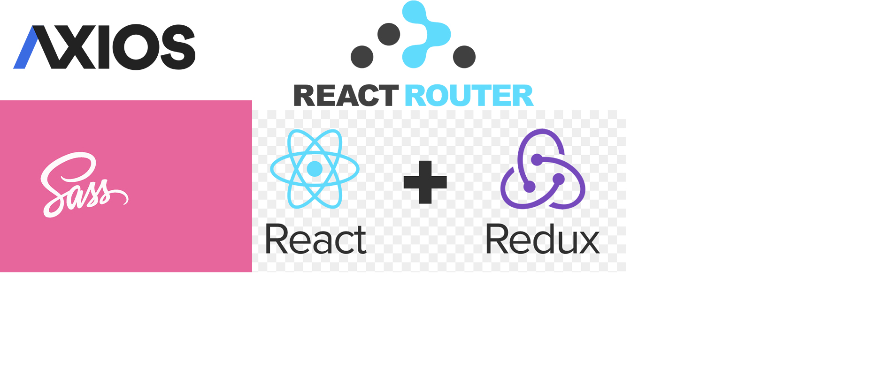
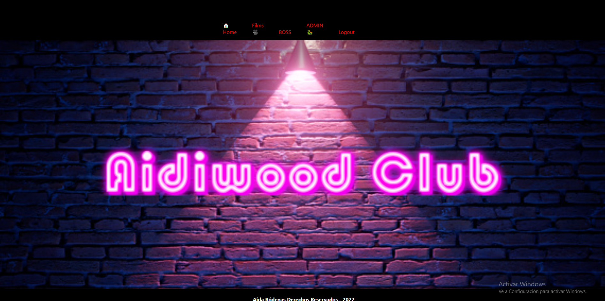

# PROYECTO NÚMERO 5

## EXPLICACIÓN :
El proyecto consiste en la representación de un videoclub, donde el usuario puede registrarse, hacer login y alquilar peliculas. El usuario con el rol administrador podrá ver la lista de usuarios existentes y los pedidos de estos. 

(para acceder como administrador debes poner en el login)

Email: admin@admin.com

Password: 1234

## INSTALACIÓN DEL PROYECTO :
El proyecto ha sido creado en yarn. por lo tanto deberás introducir lo siguientes comandos dependiendo de lo que quieras hacer:

### Instalación de dependencias:
yarn // yarn install

### Iniciar el proyecto:
yarn start

## TECNOLOGÍAS UTILIZADAS :

## IMÁGENES DEL PROYECTO :

## ENLACES :

### Backend : 
https://github.com/AidaRP/Project_Four.git
### Deploy :
https://main.d2ma3bvgj6t2pw.amplifyapp.com/
